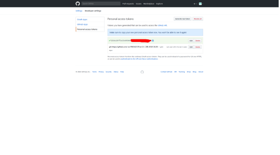

# Settings Sync
一个可以在github上面通过gist仓来同步用户的vscode的配置包括插件,settings等信息的好插件.

---

这个插件的配置和使用分几个步骤：
## 安装插件：
1. 打开vs code, 按下快捷键 ctrl + p, 输入 ext install settings sync

2. 选择如下图所示的插件安装:

图1. settings_sync插件

 
 

## github的gist设置, 生成token

在安装完settings_sync插件之后，重启 VS Code, 按下快捷键 alt + shift + u, 会弹出一个窗口，对应的就是github上面创建个人gist的页面(如果没有登陆github的话，需要先登陆)

如上图所示，设置成功后，点击"Generate token", 会生成一个key:

## 将当前VS Code的配置上传到github上

生成步骤2的key之后，回到VS Code，会发现它有一个输入区，将步骤2生成的key输入

这时，查将settings_sync就会对本机的配置进行一个扫描上传了，至此，上传工作完成。上传完成后，将会看到如下类似信息

这些信息需要保存下来，尤其是Github Token行以及Github Gist行。

## 将VS Code的配置下载到一台新的机器上

1. 在一台新的机器上，安装 settings Sync这个插件
2. 安装完插件之后，按下快捷键 alt + shift + d, 他会弹出一个输入框，按照提示，依次输入保存的 Github token 和 Github gist，回车后将会自动下载之前上传的配置。

## 一些快捷键的介绍

Alt + Shift + U : 上传和更新配置

Alt + Shift + D : 下载配置

F1: 打开输入框

其他详细信息，可以阅读 settings sync的介绍文档，里面非常详细.

