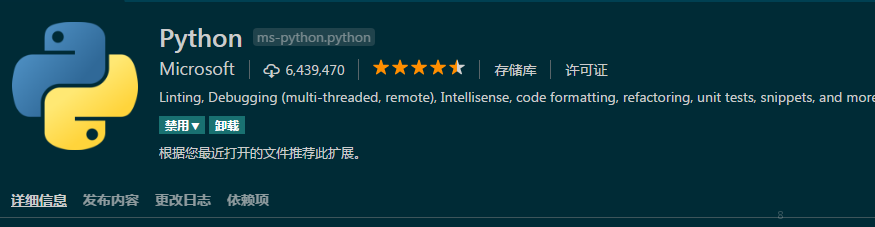

# VS Code + Anaconda打造Python环境

---

以前一直使用sublim text3做python的开发，最近尝试了VS Code之后，就被VS Code 的代码提示功能深深吸引，所以根据网上的介绍，将 VS Code 和 Anaconda搭配起来，做为Python的开发环境。 

## Anaconda的下载和安装

1. 下载安装Anaconda: [anaconda下载地址]( https://www.anaconda.com/download/)

2. 将anaconda的路径添加到"环境变量" -> "系统变量" -> "path": 
    ```
    C:\Program Files\Anaconda2;C:\Program Files\Anaconda2\Scripts;C:\Program Files\Anaconda2\Library\bin  (如果在安装时已经添加环境变量，可以忽略本步骤)
    ```

## Python插件的安装

1. 打开VS Code, 按下 Ctrl + P，在面板里输入 ext install python

2. 安装如下图所示的插件:

<center>


图1. vscode python插件
</center>

3. 如果发现，还安装了其他的python插件的话，可以禁用其他的插件，例如我这里除了上图的插件，还安装了”Python for VSCode" 这个插件， 在测试上图的python插件是否安装成功时，总是跟其他的教程显示的结果不一样，然后我禁用了 "Pyhton for VSCode" 这个插件，就正常了。

4. 配置flake8:

    a). 打开 windows的命令行: cmd

    b). 输入 pip install flake8 

    c). 安装完成后，打开vscode, 文件 -> 首选项 -> 设置， 在“用户设置”里， 输入:

        "python.linting.pylintEnabled": false,
        "python.linting.flake8Enabled": true,

5. 配置 yapf:

    a). 打开命令行; cmd

    b). 输入 pip install yapf

    c). yapf安装成功后，打开VScode, 文件 -> 首选项 -> 设置， 在“用户设置”里，输入
    
        "python.formatting.provider": "yapf",