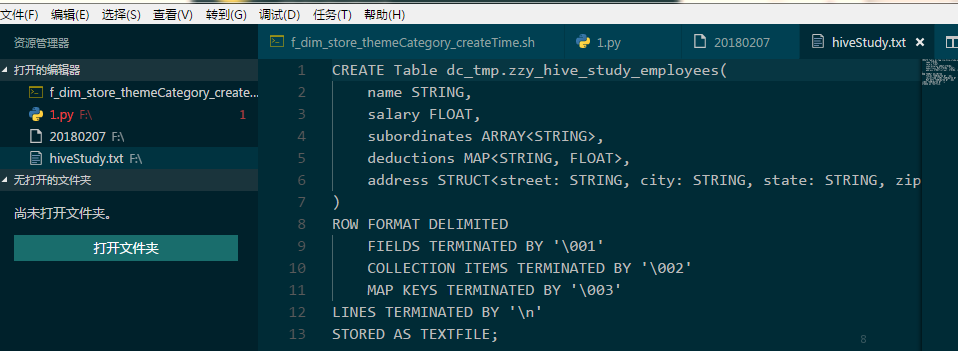

# vscode-icons 插件
 
 ---

这个插件的功能是会在左侧的资源管理器和顶部的文件便签上根据文件类型的不同显示不同的图标

1. 打开VS Code, 按下快捷键 Ctrl + P, 输入ext install vscode-icons

2. 安装如下图所示的插件:

图1. vscode-icons插件

3. 显示效果如下图:

图2. vscode-icons插件的显示效果

我们可以看到，左侧每一个文件的图标都是不同的，同时，在右侧，每一个文件的标签的左上角的图标也是不同的。